**Các bước cài đặt Wazuh:**

Cấu hình máy ảo

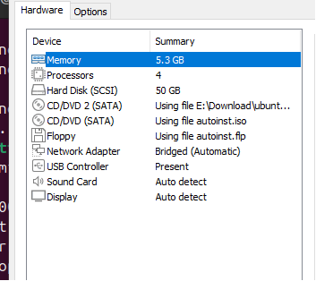

Ip máy Wazuh 192.168.0.117

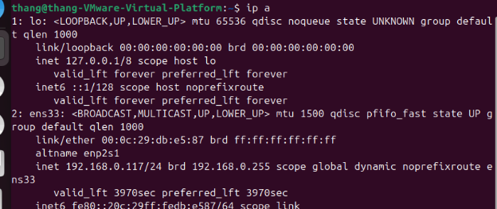

Cài đặt curl và tar (nếu chưa có):

**sudo apt-get update && sudo apt-get install curl tar -y**

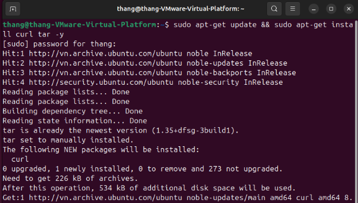

Tải script cài đặt Wazuh:

**curl -sO [**https://packages.wazuh.com/4.11/wazuh-install.sh**](https://packages.wazuh.com/4.11/wazuh-install.sh)**

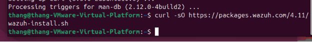

**Chạy lệnh cài đặt All-in-one:** Lệnh này sẽ cài đặt tất cả thành phần và tự tạo chứng chỉ SSL.

**sudo bash wazuh-install.sh -a**

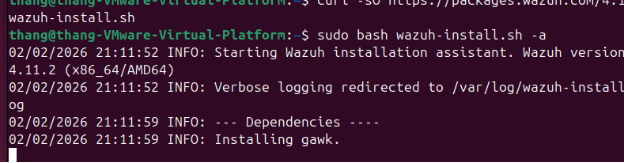

**Tạo file script integration**

sudo nano /var/ossec/integrations/custom-shuffle.py

**Khai báo Webhook đã tạo ở Soar ví dụ tấn công Bruth Force trên máy chạy Wazuh manager**

sudo nano /var/ossec/etc/ossec.conf 

Chèn đoạn code vào ngay trên </ossec\_config>

<command>

`    `<name>win\_route-null</name>

`    `<executable>route-null.cmd</executable>

`    `<expect>srcip</expect>

`    `<timeout\_allowed>yes</timeout\_allowed>

`  `</command>

`  `<active-response>

`    `<command>win\_route-null</command>

`    `<location>defined-agent</location>

`    `<agent\_id>002</agent\_id>

`  `</active-response> 

`  `<integration>

`    `<name>shuffle</name>

`    `<hook\_url><http://192.168.0.118:3001/api/v1/hooks/webhook_3d69368d-5e68-43bc>> 

`    `<rule\_id>60204</rule\_id>

`    `<alert\_format>json</alert\_format>

`  `</integration>

Link hook\_url là link của node webhook đổi từ https sang http và rule id là 60204 Multiple Windows Logon Failures

Command chặn tấn công Bruthforce 

Lưu ý đổi port 3443 đã copy từ webhook thành 3001

**Khởi động lại Wazuh**

sudo systemctl restart wazuh-manager

**Các bước cài đặt Shufle Soar:**

Cập nhật hệ thống

sudo apt-get update && sudo apt-get upgrade -y

Cài đặt Docker:

sudo apt-get install -y curl apt-transport-https ca-certificates software-properties-common

curl -fsSL https://download.docker.com/linux/ubuntu/gpg | sudo apt-key add -

sudo add-apt-repository "deb [arch=amd64] https://download.docker.com/linux/ubuntu $(lsb\_release -cs) stable"

sudo apt-get update

sudo apt-get install -y docker-ce docker-ce-cli containerd.io

**Cài đặt Docker Compose:**

sudo apt-get install docker-compose-plugin

**Cấu hình hệ thống:**

sudo sysctl -w vm.max\_map\_count=262144

echo "vm.max\_map\_count=262144" | sudo tee -a /etc/sysctl.conf

**Clone Git Shuffle:**

sudo mkdir -p /opt/shuffle

cd /opt/shuffle

sudo git clone https://github.com/Shuffle/Shuffle.git .

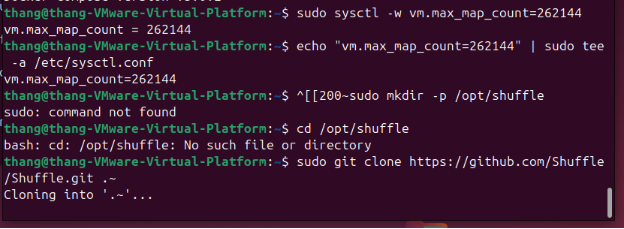

https://192.168.0.118:3443/ tôi chạy trên local nên ip khác triển khai trên máy người khác thì thay ip cài xong thì chờ 1 lúc load database rồi đăng ký tài khoản admin rồi đăng nhập như bình thường giống shuffle.io

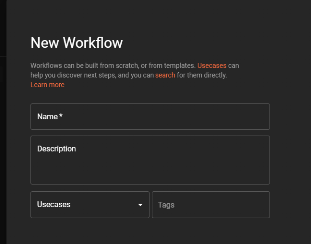

Tạo Workflow mới 

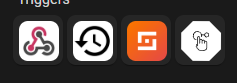

Kéo Webhook và Wazuh vào và nối chúng với nhau

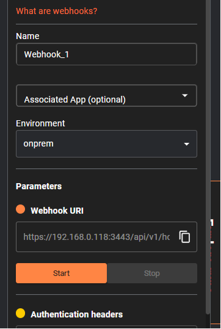

Note lại địa chỉ URL của Webhook để sửa vào file cấu hình của wazuh

Nối 2 Node HTTP 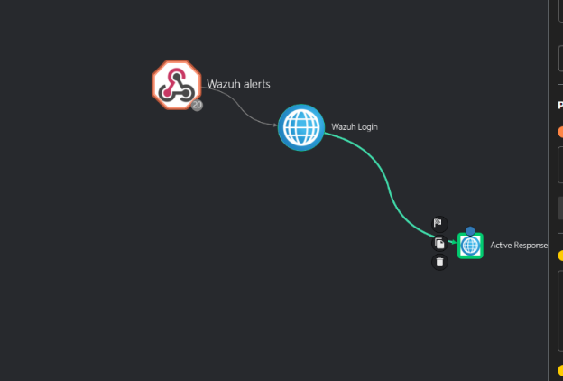

Node Wazuh có Cấu hình như sau:

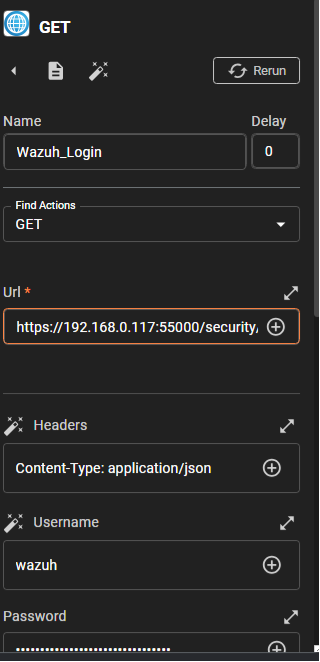

Url <https://192.168.0.117:55000/security/user/authenticate> thay bằng IP máy Wazuh username và password là tài khoản của api user 

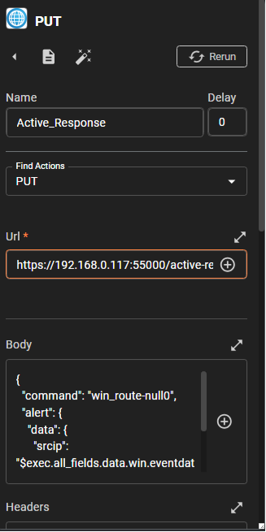

Cấu hình node thứ 2 

Url: <https://192.168.0.117:55000/active-response?agents_list=$exec.all_fields.agent.id>

Body 

{

`  `"command": "win\_route-null0",

`  `"alert": {

`    `"data": {

`      `"srcip": "$exec.all\_fields.data.win.eventdata.ipAddress"

`    `}

`  `}

}

Headers

Content-Type: application/json

Authorization:Bearer $wazuh\_login.body.data.token

Node này lấy token từ node login rồi tiến hành chặn IP tấn công BruthForce có rule id 60204 

Ấn Save rồi chạy 

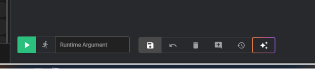

Tiến hành tấn công 

Máy Tấn công có IP 192.168.0.99 tấn công vào máy Wazuh agent có ip 192.168.0.50

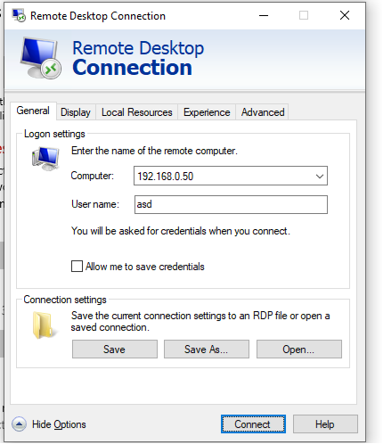 

Sau khi đăng nhập nhiều lần hiện log trên Wazuh dashboard:

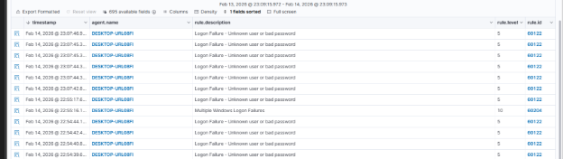

Máy Attacker không tấn công được nữa hiện chứng chỉ không hoạt động

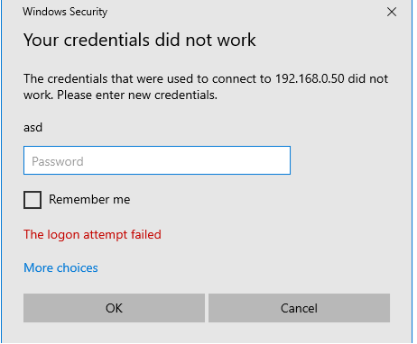

Log trên Shuffle hiện agent id bị tấn công 

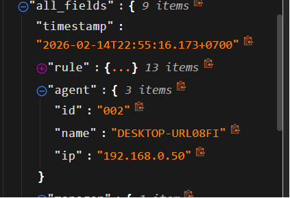

Hiện IP của attacker và tên máy 

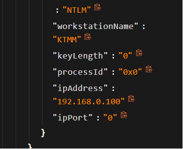

Log của node chặn IP tấn công đã gửi lệnh cho agent id 002

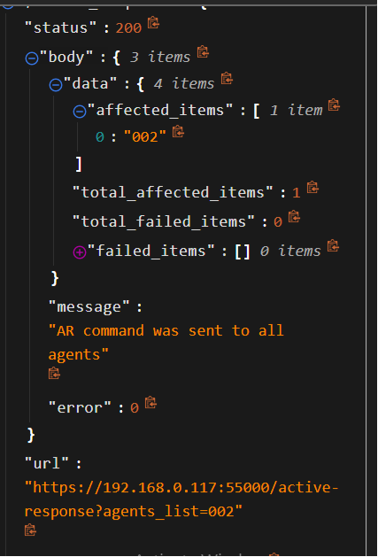

