# **GIÁM SÁT AN TOÀN THÔNG TIN**
## **1. Phòng chống tấn công Brute Force**
`	`Máy attacker (IP 192.168.0.102) sử dụng công cụ Remote Desktop Connection để tiến hành kết nối đến máy chủ mục tiêu có IP 192.168.0.50 bằng tài khoản Administrator.

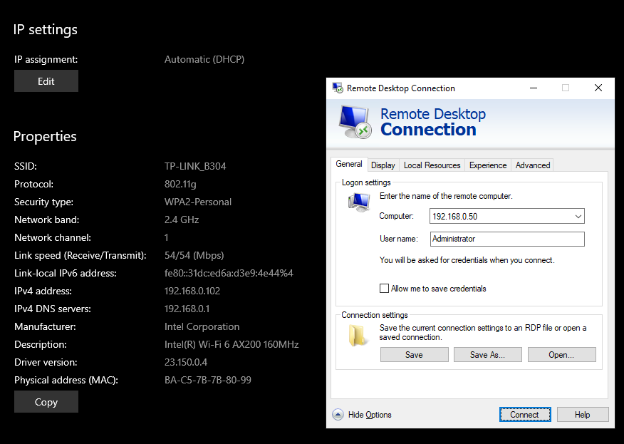

\
\
\
\
\
\
\

`	`Cửa sổ Windows Security báo lỗi đăng nhập thất bại "The logon attempt failed" do nhập sai thông tin xác thực. Đây là dấu hiệu của việc dò quét mật khẩu (Brute Force) khi kẻ tấn công cố gắng thử đăng nhập nhiều lần.

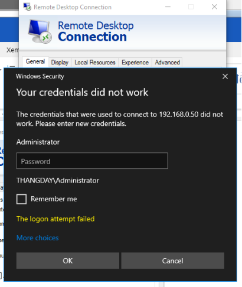

`	`Wazuh ghi nhận hàng loạt log với cảnh báo "Logon Failure - Unknown user or bad password" (Đăng nhập thất bại - Sai tài khoản hoặc mật khẩu). Với tần suất cao, hệ thống đã đẩy lên cảnh báo nghiêm trọng hơn là "Multiple Windows Logon Failures" (Nhiều lần đăng nhập Windows thất bại), chỉ báo đang có một cuộc tấn công dò mật khẩu.

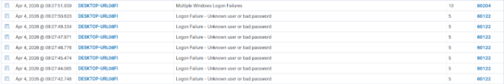

`	`Kiểm tra event log Multiple Windows Logon Failure, chỉ ra rõ nguồn gốc của các cuộc đăng nhập thất bại: Máy tính thực hiện tấn công có tên là THANGDAY với địa chỉ IP nguồn (Source Network Address) là 192.168.0.102.

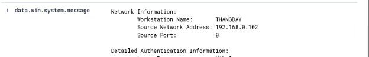

`	`Giao diện cấu hình luồng xử lý tự động (Workflow). Khi hệ thống nhận event log Multiple Windows Logon Failure cảnh báo đăng nhập sai nhiều lần từ Wazuh alerts, nó sẽ tự động tiến hành đăng nhập vào API của Wazuh Login và kích hoạt cơ chế phản ứng tự động Active response để ngăn chặn kịp thời.

![ref1]

`	`Hệ thống SOAR tự động trích xuất các thông tin từ sự kiện (eventdata) như: IP kẻ tấn công (192.168.0.102), tài khoản bị nhắm tới (Administrator) và tiến hành gọi API tới Wazuh Server (https://192.168.0.117:55000/active-response...) để ra lệnh xử lý trên Agent đang bị tấn công (Agent 013).

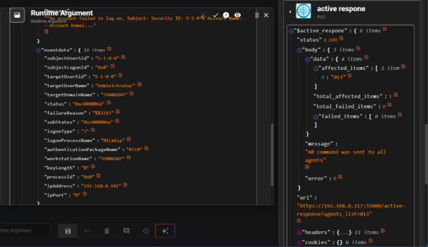

`	`Trích xuất chi tiết lệnh Active Response được gửi đi: Hệ thống sử dụng câu lệnh win\_block1800 (lệnh tự động khóa kết nối trên Windows trong thời gian 1800 giây) đối với địa chỉ IP nguồn của kẻ tấn công là 192.168.0.102.

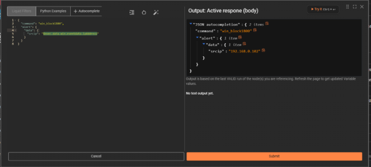

`	`Sau khi kịch bản phản ứng tự động (Active Response) được thực thi, máy tính của kẻ tấn công hoàn toàn bị ngắt kết nối. Màn hình báo lỗi "Remote Desktop can't connect to the remote computer" chứng tỏ lưu lượng mạng từ IP 192.168.0.102 đến máy chủ đã bị Firewall chặn đứng.

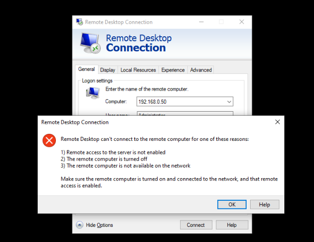

`	`Kiểm tra trực tiếp tại máy chủ bị tấn công (Windows Firewall), một luật (Inbound Rule) mới có tên là WAZUH ACTIVE RESPONSE BLOCKED IP đã được hệ thống tự động tạo ra. Trong phần Properties  của Rule này, hành động đã được thiết lập thành "Block the connection" (Chặn kết nối), đảm bảo vô hiệu hóa hoàn toàn mọi truy cập tiếp theo từ IP của kẻ tấn công vào hệ thống.

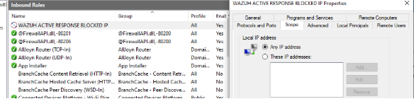

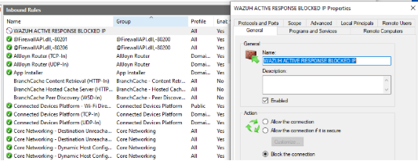
## **2. Phòng chống tấn công SQJ injection, XSS**
### ***A. SQL injection***
`	`Sau khi xác định được mục tiêu, attacker tiến hành thử nghiệm lỗ hổng SQL Injection trên ứng dụng DVWA. Bằng cách chèn payload độc hại 123' UNION ALL SELECT NULL, CONCAT('AAA',database(),'BBB')# vào trường User ID, kẻ tấn công đã vượt qua được cơ chế xác thực và trích xuất thành công thông tin nhạy cảm từ cơ sở dữ liệu.

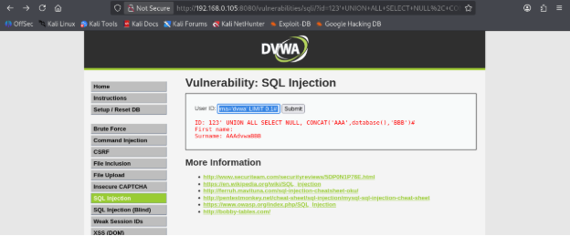

`	`Trên hệ thống giám sát ghi nhận một cuộc tấn công ứng dụng web thành công với mô tả "A web attack returned code 200 (success)". Dữ liệu cho thấy mục tiêu là máy chủ Linux-nguyen (IP 192.168.0.105) và nguồn tấn công xuất phát từ địa chỉ IP 192.168.0.104. Dựa vào trường data.url, có thể thấy rõ payload tấn công là SQL Injection (khai thác lỗ hổng UNION ALL SELECT...) nhắm vào thư mục /vulnerabilities/sqli/ của ứng dụng

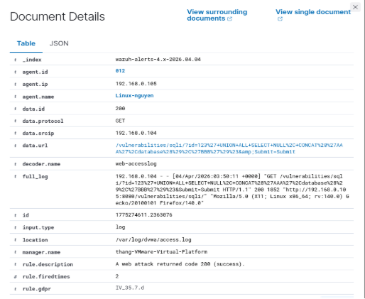

`	`Giao diện cấu hình luồng xử lý tự động (Workflow). Khi hệ thống nhận event log A web attack returned code 200 (success) cảnh báo tấn công SQL injection từ Wazuh alerts, nó sẽ tự động tiến hành đăng nhập vào API của Wazuh Login và kích hoạt cơ chế phản ứng tự động http1 để ngăn chặn kịp thời.

![ref2]

`	`Giao diện kịch bản tự động cho thấy hệ thống đang bóc tách các biến thời gian thực từ log cảnh báo. Quá trình này tự động thu thập các thông tin quan trọng như thông tin máy nạn nhân (agent id: 012, name: Linux-nguyen), địa chỉ nguồn tấn công (srcip: 192.168.0.104), và chuỗi URL chứa mã độc để chuẩn bị cho bước ngăn chặn.

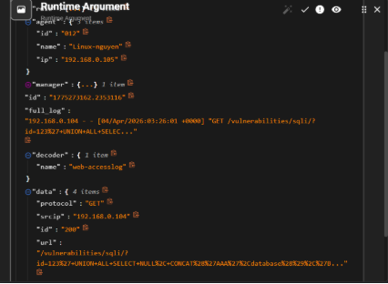

Hệ thống sử dụng phương thức PUT gọi đến endpoint. Trong phần nội dung dữ liệu gửi đi (Body), kịch bản tự động gán lệnh thực thi là "command": "firewall-drop0" và truyền trực tiếp địa chỉ IP nguồn của kẻ tấn công (được tự động trích xuất qua biến động $exec.data.src\_ip từ sự kiện cảnh báo). Đồng thời, hệ thống cũng tự động đính kèm mã xác thực (Authorization Bearer Token) trong Headers để yêu cầu API được chấp thuận, từ đó ra lệnh cho Tường lửa (Firewall) trên máy bị tấn công lập tức khóa IP độc hại này

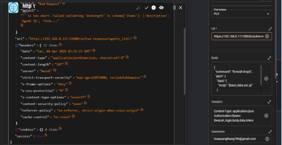

Ngay khi payload SQL Injection được gửi đi, hệ thống giám sát an toàn thông tin (Wazuh/SOAR) đã bắt được hành vi bất thường và lập tức kích hoạt kịch bản phản vệ tự động (Active Response). Kết quả là địa chỉ IP của kẻ tấn công bị đưa vào danh sách đen của tường lửa (firewall-drop). Trình duyệt của kẻ tấn công báo lỗi "Unable to connect" (Không thể kết nối), chứng tỏ IP đã bị cô lập hoàn toàn khỏi máy chủ mục tiêu.

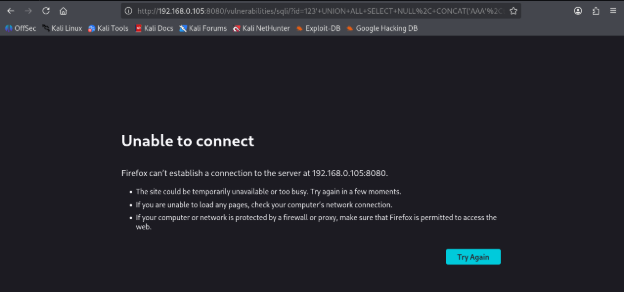

Log sự kiện cuối cùng ghi nhận từ /var/ossec/logs/active-responses.log xác nhận rằng hành động phản vệ đã được thực thi với mô tả "Host Blocked by firewall-drop Active Response". Hệ thống đã tự động chạy script firewall-drop để chặn IP của kẻ tấn công ngay tại mức tường lửa (Firewall) của máy chủ Linux. Log này cũng gắn nhãn hành vi tấn công theo framework MITRE ATT&CK với kỹ thuật khai thác ứng dụng công khai

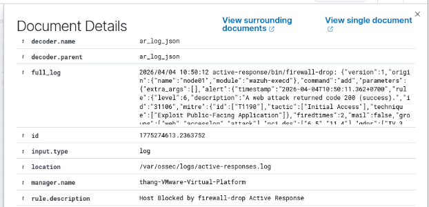
### ***B. XSS***
`	`Attacker kiểm tra khả năng phản xạ dữ liệu của ứng dụng web bằng một chuỗi bình thường ("123"), sau đó bắt đầu nhập payload chứa mã JavaScript độc hại  vào trường nhập liệu để kiểm tra xem hệ thống có bộ lọc dữ liệu (filter) hay không.

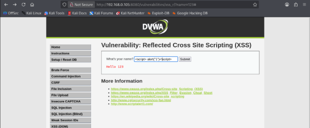

`	`Lỗ hổng Reflected XSS đã bị khai thác thành công. Payload của kẻ tấn công không bị ứng dụng web ngăn chặn, dẫn đến việc đoạn mã JavaScript được trả về và thực thi thẳng trên trình duyệt. Hộp thoại cảnh báo (Pop-up Alert "1") xuất hiện là minh chứng cho việc kẻ tấn công có thể chèn mã độc để đánh cắp phiên đăng nhập (Cookie) hoặc điều hướng người dùng.

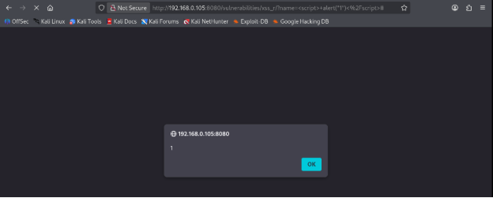

`	`Hệ thống giám sát (Wazuh) ghi nhận liên tục nhiều cảnh báo với mức độ 6 (Level 6) mang nội dung "A web attack returned code 200 (success)". Điều này cho thấy máy chủ mục tiêu Linux-nguyen đang bị một đối tượng rà quét hoặc tấn công liên tục vào ứng dụng web, và các truy vấn độc hại này đều lọt qua được và trả về mã thành công (HTTP 200).

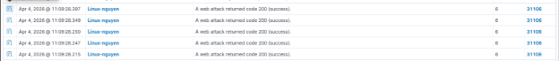

`	`Kiểm tra chi tiết một log cảnh báo (Document Details) cho thấy nguồn tấn công đến từ địa chỉ IP 192.168.0.104. Dựa vào trường data.url, có thể nhận diện rõ kẻ tấn công đang cố gắng khai thác lỗ hổng Cross-Site Scripting (XSS) thông qua tham số name với payload chứa mã JavaScript độc hại: %3Cscript%3Ealert... (tương đương với chuỗi ).

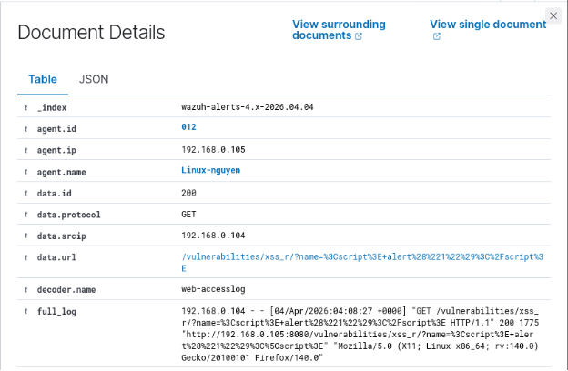

`	`Ngay khi hệ thống phát hiện tấn công, nền tảng điều phối và phản ứng tự động (SOAR) lập tức được kích hoạt. Nút (Node) đầu tiên sẽ tự động thu thập và bóc tách các biến từ log, bao gồm thông tin máy bị tấn công (agent id: 012, Linux-nguyen) và đặc biệt là địa chỉ IP của kẻ tấn công để làm đầu vào cho bước xử lý tiếp theo.

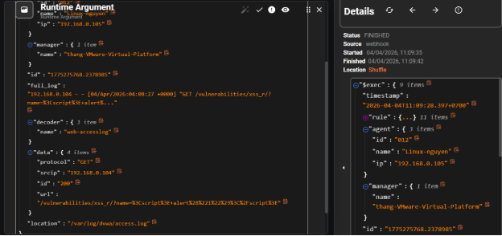

`	`Chuyển sang bước phản ứng, hệ thống SOAR thiết lập một HTTP Request (phương thức PUT) gọi tới API của máy chủ Wazuh (https://192.168.0.117:55000/active-response...). Trong phần nội dung (Body), hệ thống tự động truyền lệnh firewall-drop0 và gán tự động địa chỉ IP của kẻ tấn công (thông qua biến $exec.data.src\_ip) để ra lệnh cho tác nhân thực thi việc khóa mạng.

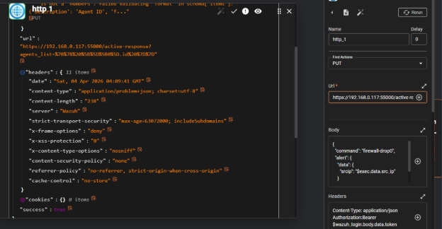

`	`Kẻ tấn công cố gắng thay đổi payload XSS bằng một biến thể khác (sử dụng thẻ hình ảnh ) để tiếp tục khai thác. Tuy nhiên, luồng giám sát một lần nữa phát hiện ra chữ ký tấn công (Signature) trong URL. Tương tự như kịch bản SQLi, hệ thống Active Response lập tức được kích hoạt, tự động cấu hình Tường lửa chặn IP nguồn. Kẻ tấn công lần nữa bị ngắt kết nối hoàn toàn khỏi máy chủ ("Unable to connect").

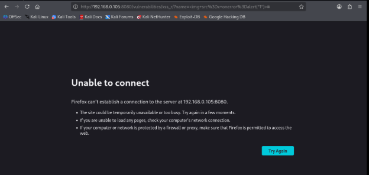

`	`Ngay sau khi API được gọi, Wazuh Dashboard ghi nhận các sự kiện phản ứng tự động đã diễn ra với mô tả "Host Blocked by firewall-drop Active Response". Chi tiết log xác nhận script firewall-drop đã được chạy cục bộ trên máy Linux-nguyen, tự động thêm IP gốc của kẻ tấn công vào luật cấm (Drop) của tường lửa, cắt đứt hoàn toàn chuỗi tấn công XSS.

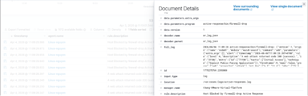

## **3. Phòng chống tấn công Network Scan, DoS**
### ***A. Network Scan***
`	`IP của máy nạn nhân trong wazuh agent mà hacker sẽ tấn công 

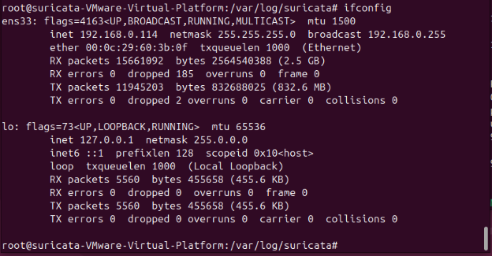

`	`Kẻ tấn công sử dụng lệnh nmap để quét nhiều cổng của máy Wazuh Agent

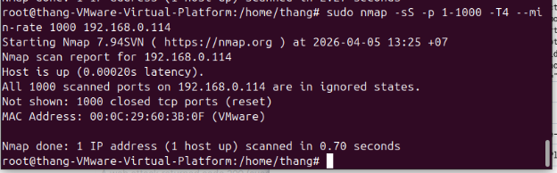

`	`Khi hacker tấn công thì bên phía Wazuh Manager sẽ hiển thị một loạt log PORT SCAN NMAP

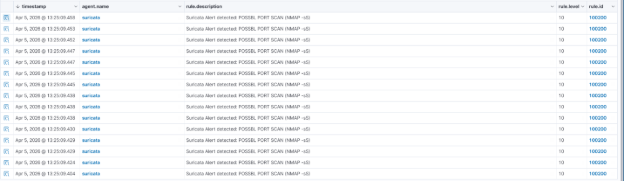

`	`Chi tiết 1 log của Wazuh khi hacker tấn công 

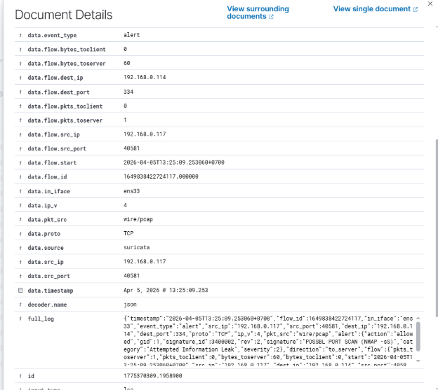

`	`Bên phía máy SOAR Shuffler sẽ nhận được log từ bên phía Wazuh Manager gửi về và sẽ tiến hành tự động chặn ip có src\_ip 192.168.0.117

![ref3]

`	`Sử dụng iptables tưởng lửa của linux để chặn ip khi xem danh sách luồng INPUT sẽ thấy ip của kẻ tấn công 

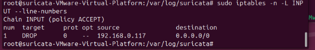

`	`Sau đó thì máy tấn công sẽ không ping được cho máy nạn nhân nữa 

![ref4]

### ***B. Dos***
`	`Kẻ tấn công sử dụng lệnh hping3 để tấn công dos máy Wazuh Agent

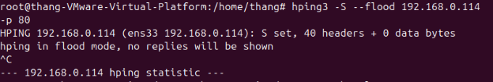

`	`Khi hacker tấn công thì bên phía Wazuh Manager sẽ hiển thị một loạt log tạo nhiều flow

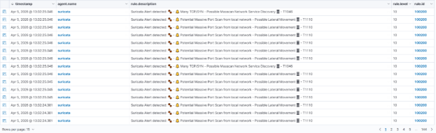

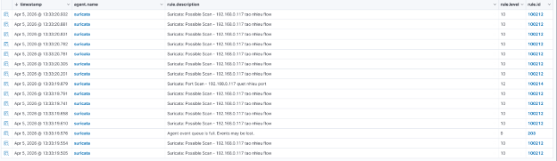

`	`Chi tiết 1 log của Wazuh khi hacker tấn công 

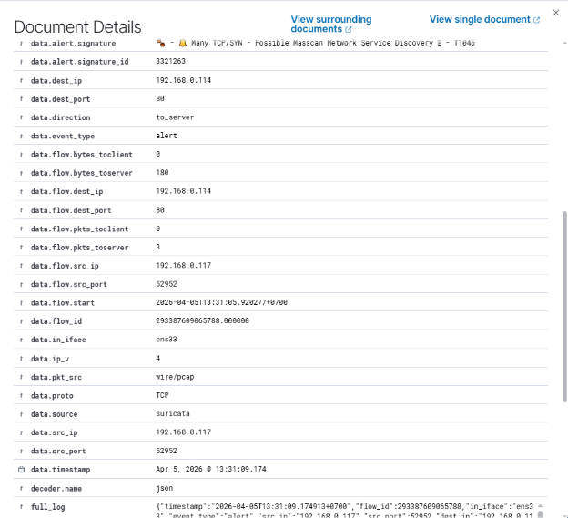

`	`Bên phía máy SOAR Shuffler sẽ nhận được log từ bên phía Wazuh Manager gửi về và sẽ tiến hành tự động chặn ip có src\_ip 192.168.0.117

![ref3]

`	`Bên phía máy SOAR Shuffler sẽ nhận được log từ bên phía Wazuh Manager gửi về và sẽ tiến hành tự động chặn ip có src\_ip 192.168.0.117

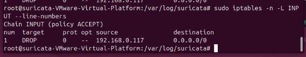

`	`Sau đó thì máy tấn công sẽ không ping được cho máy nạn nhân nữa 

![ref4]

[ref1]: Aspose.Words.96974de6-e413-4b93-be73-bc972d7ed53c.005.png
[ref2]: Aspose.Words.96974de6-e413-4b93-be73-bc972d7ed53c.013.png
[ref3]: Aspose.Words.96974de6-e413-4b93-be73-bc972d7ed53c.030.png
[ref4]: Aspose.Words.96974de6-e413-4b93-be73-bc972d7ed53c.032.png
